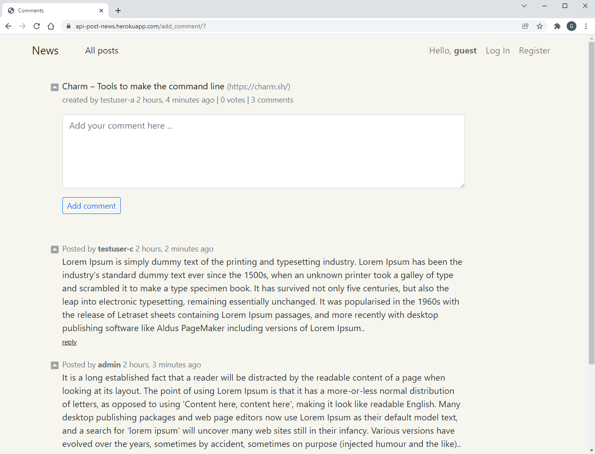

# News

## Project Description

News is an online service for collection of the list of news with appropriate links, possibility to upvote and comments on them. The application is developed on Python, Django, Django REST Framework (DRF) and JavaScript and consist of two parts visual and Rest API.

Any logged-in user can upvote a post, add comment, submit new post, update or delete his/her own post. 

Upvote the post is possible by click on a little squire button with a triangle inside on the left side of the screen.

The application has a recurring job running once a day to reset upvotes count.

## Inside the project
   
The root folder of the project consists of: 
   
- the project folder ***news*** (configurations), 
- application folder ***posts*** (processing usual HTTP requests and rendering HTML pages, including login and register pages)
- application folder ***apis*** (processing Rest API requests and generation json responses)
- several files: *manage.py* (generated by Django), *README.md* (this file), *requirements.txt* (project dependencies), *.gitignore*, and two files required for deployment on heroku: *Procfile* and *runtime.txt*. 

The root folder of the project also includes ***readme_docs*** folder with some documents mentioned in this README.md file.

Among usual files, the ***posts*** folder also contains ***management*** folder (custom command) and *cron.py* (recurring job, as mentioned above).

 
## Deployment on heroku

The project is deployed on heroku and is available [here](https://api-post-news.herokuapp.com/). 
  

## Testing

Rest API requests may be tested with Postman, on DRF generated pages or othervise.

## How to run application

   As mentioned, the application is already deployed on heroku.

   Alternatively, the dockerized version of the application may be instantiated and run locally as follows:

   1. Create root folder `mkdir <root_folder_name>`.

   2. Go to root folder `cd <root_folder_name>`.

   3. Copy .env.dev and .env.db files from [readme_docs](readme_docs) folder to this root folder.

   4. Generate new Django SECRET_KEY [here](https://miniwebtool.com/django-secret-key-generator/) and add it to .env.dev.

   5. Create project folder `mkdir news` and from [readme_docs](readme_docs) copy to the project folder: docker-compose.yml [readme_docs](readme_docs) and, optionaly, db.json. The latter may be convenient to fill in the application DB with some first data (see item 11 below).
   
   6. Go to the project folder 'cd news'.

   7. Being in the project folder, run in the command line (CLI): first `docker-compose pull` and then `docker-compose up -d`.

   8. Check if application is launched in browser at '0:0:0:0:8000' or 'localhost:8000'.

   9. In CLI run `docker-compose exec web python manage.py createsuperuser`. Add you credentials.

   11. Optionally, run `docker-compose exec web python manage.py loaddata db.json` in the command line.

   12. Web application is ready for use in dev mode at '0:0:0:0:8000' or 'localhost:8000'.

   13. To check the crontab settings run `python manage.py crontab show` in CLI. To stop or restart the job run 'python manage.py crontab remove' or 'python manage.py crontab add' respectively.

   Notes:
 
   - In order to run dockerized version of the application, you should have docker installed on you local computer.

   - Replace <root_folder_name> with any arbitrary name. 

   - Dockerized version of this application is not configured for production.     
